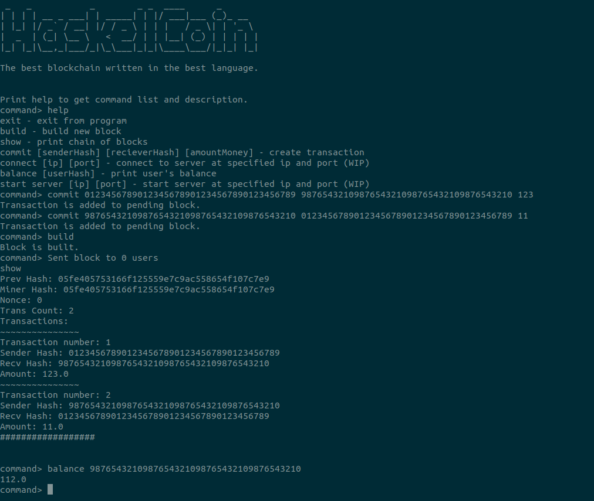

# HaskellCoin

[](https://github.com/MasterLogick/HaskellCoin/actions/workflows/haskell.yml)

Yet another blockchain but written in Haskell this time.



Print `help` to get the list of commands.
In alpha version you can commit transaction from any address to any address without limitations on amount. Just enter `commit` with user hashes and amount and enter `build` to create new block in the network.
Print `show` to list all blocks and transactions in the network.

## Development

The project is developed with both stack and cabal.

### Building from sources

For building with `cabal`:
```sh
git clone https://github.com/MasterLogick/HaskellCoin
cd HaskellCoin
cabal v2-build
```
And for starting HaskellCoin just run `cabal v2-run` 

For building using `stack`:
```sh
git clone https://github.com/MasterLogick/HaskellCoin
cd HaskellCoin
stack build
```
And for starting HaskellCoin just run `stack run`

## Alpha version description:

Minimal blockchain system. The whole chain runs on the local machine without any network rules or transaction signing. CLI only.

Features:
+ Commit new trasnactino to pending block
+ Build new block from pending transactions
+ Show all blocks and transactions
+ Show current balance of specified user


## Release version features:

+ Blockchain explorer
+ Migrating to PoW (Proof of Work)
+ Saving blockchain to hard drive
+ Digital signature for every user (ECDSA on NIST-P521R1)
+ Propagating blocks over the Internet
+ Network rules
